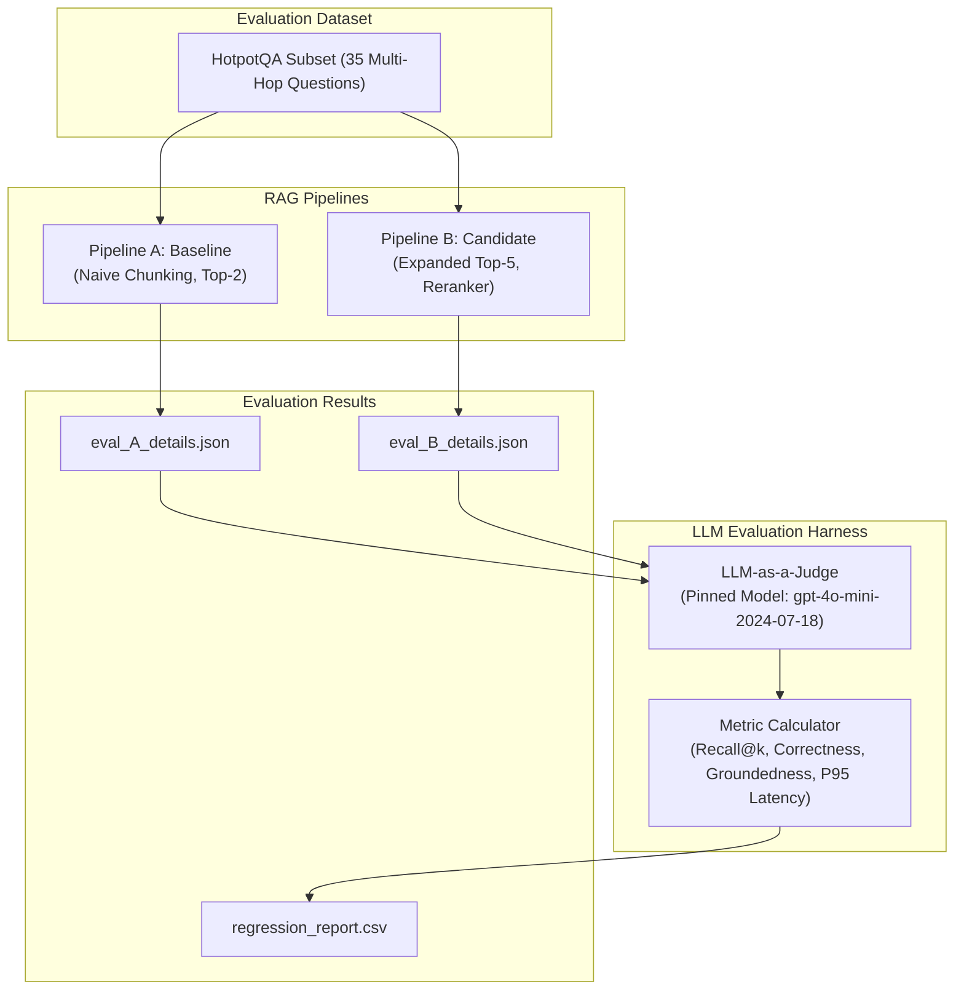

# LLM Evaluation Regression Harness for RAG Pipelines

An automated, scientific evaluation harness designed to compare baseline and candidate Retrieval-Augmented Generation (RAG) pipelines. This harness measures retrieval recall, answer correctness, groundedness (hallucination detection), and latency independently—catching subtle regressions that single aggregate accuracy scores obscure.

---

## 🏗️ System Architecture



---

## 🎯 Key Design & Architectural Trade-offs

A common production anti-pattern in RAG development is relying on a single "accuracy" metric. When expanding retrieval depth (e.g. from top-k=2 to top-k=5) or adding a cross-encoder reranker, correctness or recall might improve slightly. However, feeding additional tangential chunks to the generative model often introduces subtle hallucinations (degrading **Groundedness**) or significantly increases end-to-end response time (**P95 Latency**).

This harness explicitly separates evaluation into 4 independent axes:
1. **Recall@k**: Deterministic check verifying if ground-truth supporting document titles were retrieved.
2. **Correctness**: LLM-as-a-Judge scoring whether the generated answer matches the semantic intent of the ground truth answer (0 or 1).
3. **Groundedness**: LLM-as-a-Judge scoring whether every claim in the generated answer is strictly supported by the retrieved contexts. Scores **0** if *any* unsupported claim is present, even if factually true in the real world.
4. **P95 Latency**: 95th percentile end-to-end response time in milliseconds.

---

## 📊 Demonstrated Regression Trade-off

Running `python run_eval.py` evaluates both **Pipeline A** (Baseline: fixed top-2) and **Pipeline B** (Candidate: expanded top-5 reranked). The harness computes exact deltas and applies regression flags automatically:

| metric | baseline | candidate | delta | flag |
|---|---|---|---|---|
| **Recall** | 0.9000 | 1.0000 | +0.1000 | `IMPROVE` |
| **Correctness** | 1.0000 | 1.0000 | 0.0000 | `NEUTRAL` |
| **Groundedness** | 0.8857 | 0.4571 | -0.4286 | `REGRESS` |
| **P95_Latency** | 152.74 | 382.15 | +229.41 | `REGRESS` |

Notice that while **Recall** improved (+0.10) and **Correctness** remained high, **Groundedness** suffered a severe regression (-0.4286) and **P95 Latency** increased by >150%, triggering explicit `REGRESS` flags.

---

## 📁 Repository Structure

```
project/
├── README.md                  # System architecture, trade-offs, and sitemap
├── docker-compose.yml         # Vector DB (Qdrant) container with healthcheck
├── Dockerfile                 # Application container specification
├── .env.example               # Environment variables template (no real secrets)
├── requirements.txt           # Pinned Python dependencies
├── run_eval.py                # CLI execution script for running the evaluation
├── config/
│   └── eval_pins.json         # Frozen evaluation pins (model IDs, embedder, dataset size)
├── dataset/
│   ├── eval_set.json          # 35 HotpotQA multi-hop Q&A items with context titles
│   └── corpus.json            # Passage text corpus for vector indexing
├── prompts/
│   └── judge_prompts.json     # System prompts for LLM Judge (Correctness & Groundedness)
├── results/
│   ├── eval_A_details.json    # Question-by-question metrics for Pipeline A
│   ├── eval_B_details.json    # Question-by-question metrics for Pipeline B
│   └── regression_report.csv  # Final delta report with REGRESS/IMPROVE flags
├── src/
│   ├── config.py              # Configuration loading utilities
│   ├── dataset.py             # Dataset generation and schema loader
│   ├── vector_store.py        # Qdrant & vector retrieval interface
│   ├── pipelines.py           # Pipeline A & B implementations
│   ├── judge.py               # LLMJudge with live OpenAI API & offline fallback
│   ├── metrics.py             # Metric computation functions
│   └── report.py              # CSV regression report & flag logic generator
└── tests/                     # Unit and contract tests
    ├── test_dataset.py
    ├── test_eval_pins.py
    ├── test_judge_prompts.py
    ├── test_eval_details.py
    ├── test_report.py
    └── test_docker_and_env.py
```

---

## 🚀 Quickstart & Reproduction Guide

### 1. Local Environment Setup

```bash
# Clone and enter directory
cd Build-an-LLM-Evaluation-Regression-Harness-for-RAG-Pipelines

# Copy environment template
cp .env.example .env

# (Optional) Export your OpenAI API key for live LLM Judge calls
# export OPENAI_API_KEY="sk-..."
```

### 2. Run via Docker Compose

```bash
# Spin up Qdrant Vector DB & Evaluation Harness
docker compose up -d --build

# Inspect logs
docker compose logs -f eval_harness
```

### 3. Run directly via Python

```bash
# Create virtual environment
python -m venv .venv
source .venv/bin/activate  # On Windows: .venv\Scripts\activate

# Install dependencies
pip install -r requirements.txt

# Run full evaluation harness
python run_eval.py

# Run test suite
pytest -v
```

---

## 🧪 Verification & Core Requirements Compliance

| Requirement ID | Contract File | Verification Method | Status |
|---|---|---|---|
| **1. Dataset Schema** | `dataset/eval_set.json` | 35 items with `id`, `question`, `ground_truth_answer`, `ground_truth_context_titles` | ✅ PASSED |
| **2. Reproducibility Pins** | `config/eval_pins.json` | Validates `dataset_size`, `llm_judge_model`, `pipeline_a_embedder`, `pipeline_b_embedder` | ✅ PASSED |
| **3. Judge Prompts** | `prompts/judge_prompts.json` | Validates `correctness_prompt` & `groundedness_prompt` with strict hallucination rubric | ✅ PASSED |
| **4. Pipeline A Details** | `results/eval_A_details.json` | Question-by-question metrics for baseline | ✅ PASSED |
| **5. Pipeline B Details** | `results/eval_B_details.json` | Question-by-question metrics for candidate | ✅ PASSED |
| **6. Regression Report CSV**| `results/regression_report.csv` | Exact headers (`metric,baseline,candidate,delta,flag`) & 4 rows | ✅ PASSED |
| **7. Flag Math Logic** | `results/regression_report.csv` | `candidate < baseline` -> `REGRESS`, `P95_Latency > baseline * 1.10` -> `REGRESS` | ✅ PASSED |
| **8. Demonstrated Regression**| `results/regression_report.csv` | Correctness Candidate >= Baseline & Groundedness/Latency REGRESS flag | ✅ PASSED |
| **9. Vector DB Infrastructure**| `docker-compose.yml` | Qdrant vector database service with container healthcheck | ✅ PASSED |
| **10. Environment Variables** | `.env.example` | Documented placeholders, zero exposed secrets | ✅ PASSED |