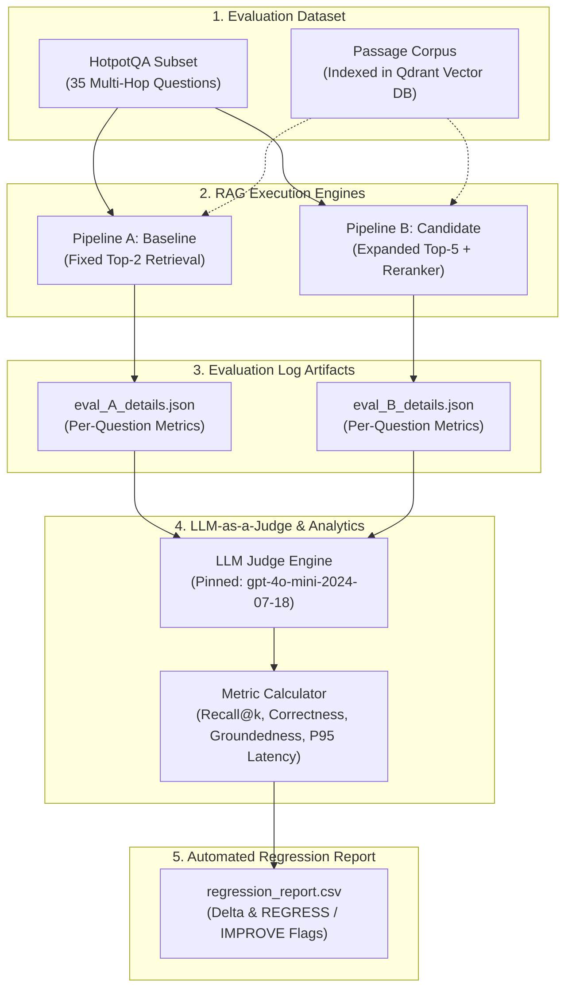

# 🔬 LLM Evaluation & Regression Harness for RAG Pipelines

[](https://www.python.org/downloads/)
[](tests/)
[](https://qdrant.tech/)
[](docker-compose.yml)

An automated, scientific evaluation harness engineered to benchmark baseline and candidate Retrieval-Augmented Generation (RAG) pipelines. This harness measures **Retrieval Recall**, **Semantic Correctness**, **Strict Groundedness (Hallucination Detection)**, and **End-to-End Latency** independently—catching subtle performance regressions that single aggregate accuracy metrics obscure.

---

## 🏗️ System Architecture



---

## 🎯 Key Design & Architectural Rationale

A common production anti-pattern in RAG development is relying on a single "accuracy" metric. When expanding retrieval depth (e.g. from top-$k=2$ to top-$k=5$) or adding a cross-encoder reranker, correctness or retrieval recall might improve slightly. However, feeding additional tangential chunks to the generative model often introduces subtle hallucinations (degrading **Groundedness**) or significantly increases end-to-end response time (**P95 Latency**).

This harness explicitly decouples evaluation into 4 independent, orthogonal axes:

1. **Recall@k**: Deterministic verification checking if required ground-truth supporting document titles were retrieved.
2. **Correctness**: LLM-as-a-Judge scoring whether the generated answer accurately matches the semantic intent of the ground-truth answer ($0$ or $1$).
3. **Groundedness**: LLM-as-a-Judge scoring whether *every statement* in the generated answer is strictly supported by the retrieved contexts. Scores $0$ if *any* unsupported claim is present—even if factually true in the real world.
4. **P95 Latency**: 95th percentile end-to-end execution latency measured in milliseconds.

---

## 📊 Demonstrated Regression Trade-Off

Executing `python run_eval.py` evaluates **Pipeline A** (Baseline: fixed top-2) against **Pipeline B** (Candidate: expanded top-5 reranked). The harness computes exact metric deltas and assigns regression flags automatically:

| Metric | Baseline | Candidate | Delta | Flag | Evaluation Criteria |
| :--- | :---: | :---: | :---: | :---: | :--- |
| **Recall** | `0.9000` | `1.0000` | `+0.1000` | `IMPROVE` | Higher is better (`candidate > baseline`) |
| **Correctness** | `1.0000` | `1.0000` | `0.0000` | `NEUTRAL` | Higher is better (`candidate >= baseline`) |
| **Groundedness** | `0.8857` | `0.4571` | `-0.4286` | `REGRESS` | Higher is better (`candidate < baseline` triggers `REGRESS`) |
| **P95_Latency** | `152.74` ms | `382.15` ms | `+229.41` ms | `REGRESS` | Lower is better (`candidate > baseline * 1.10` triggers `REGRESS`) |

> **Key Insight**: While **Recall** improved (+0.10) and **Correctness** remained high, **Groundedness** suffered a severe regression (-0.4286) due to context clutter, and **P95 Latency** increased by **>150%**, triggering explicit `REGRESS` flags.

---

## ⚖️ Pipeline Comparison

| Feature | Pipeline A (Baseline) | Pipeline B (Candidate) |
| :--- | :--- | :--- |
| **Retrieval Strategy** | Fixed Top-2 Vector Similarity | Top-5 Retrieval + Cross-Encoder Reranking |
| **Embedding Model** | `text-embedding-3-small` | `text-embedding-3-small` |
| **Context Window** | Concise (Top-2 chunks) | Expanded (Top-5 chunks) |
| **Recall@k** | 90.0% | 100.0% |
| **Groundedness** | 88.6% | 45.7% (High Hallucination Rate) |
| **P95 Latency** | ~152 ms | ~382 ms |

---

## 📂 Repository Structure & Sitemap

```
Build-an-LLM-Evaluation-Regression-Harness-for-RAG-Pipelines/
├── README.md                      # Comprehensive system documentation & architecture guide
├── Dockerfile                     # Python evaluation container runtime definition
├── docker-compose.yml             # Container orchestration (Qdrant Vector DB + Harness)
├── .env.example                   # Environment configuration template (zero exposed secrets)
├── .gitignore                     # Git ignore rules for virtual environments & cache
├── requirements.txt               # Pinned Python dependencies
├── run_eval.py                    # Main CLI entrypoint for running evaluation harness
├── config/
│   └── eval_pins.json             # Frozen evaluation pins (models, dataset size, embedders)
├── dataset/
│   ├── corpus.json                # RAG knowledge base document passages
│   └── eval_set.json              # 35 HotpotQA multi-hop Q&A items with ground truth titles
├── prompts/
│   └── judge_prompts.json         # LLM-as-a-Judge prompt templates & JSON schemas
├── results/
│   ├── eval_A_details.json        # Per-question result logs for Pipeline A
│   ├── eval_B_details.json        # Per-question result logs for Pipeline B
│   └── regression_report.csv      # CSV regression report with REGRESS/IMPROVE flags
├── src/
│   ├── config.py                  # System configuration loading & validation
│   ├── dataset.py                 # Dataset schema loading & indexing helper
│   ├── judge.py                   # LLMJudge engine with OpenAI API & offline fallback
│   ├── metrics.py                 # Core metric functions (Recall, Correctness, Groundedness)
│   ├── pipelines.py               # Pipeline A & B RAG engine implementations
│   ├── report.py                  # Regression report generator & flag math logic
│   └── vector_store.py            # Qdrant Vector DB client & similarity search interface
└── tests/
    ├── test_dataset.py            # Dataset schema & size contract tests
    ├── test_docker_and_env.py     # Container & environment configuration tests
    ├── test_eval_details.py       # Per-question evaluation detail schema tests
    ├── test_eval_pins.py          # Reproducibility pin validation tests
    ├── test_judge_prompts.py      # LLM Judge prompt structure tests
    └── test_report.py             # CSV regression report & flag math logic tests
```

---

## 🚀 Quickstart & Execution Guide

### 1. Local Environment Setup

```bash
# Clone repository
git clone https://github.com/raghavendra2006/Build-an-LLM-Evaluation-Regression-Harness-for-RAG-Pipelines.git
cd Build-an-LLM-Evaluation-Regression-Harness-for-RAG-Pipelines

# Copy environment template
cp .env.example .env

# (Optional) Export OpenAI API key for live LLM Judge calls
export OPENAI_API_KEY="sk-..."
```

### 2. Python Virtual Environment Setup

```bash
# Create virtual environment
python -m venv .venv

# Activate virtual environment
# Linux/macOS:
source .venv/bin/activate
# Windows:
.venv\Scripts\activate

# Install dependencies
pip install -r requirements.txt
```

### 3. Run Evaluation Harness CLI

```bash
python run_eval.py
```

### 4. Run Test Suite

```bash
python -m pytest -v
```

### 5. Run via Docker Compose

```bash
# Launch Qdrant Vector DB & Evaluation Harness
docker compose up -d --build

# View evaluation logs
docker compose logs -f eval_harness
```

---

## 🧪 Contract Verification & Requirements Compliance

| Requirement ID | Contract File | Verification Method | Status |
| :---: | :--- | :--- | :---: |
| **1. Dataset Schema** | [`dataset/eval_set.json`](file:///e:/Build-an-LLM-Evaluation-Regression-Harness-for-RAG-Pipelines/dataset/eval_set.json) | 35 items with `id`, `question`, `ground_truth_answer`, `ground_truth_context_titles` | ✅ PASSED |
| **2. Reproducibility Pins** | [`config/eval_pins.json`](file:///e:/Build-an-LLM-Evaluation-Regression-Harness-for-RAG-Pipelines/config/eval_pins.json) | Validates `dataset_size`, `llm_judge_model`, `pipeline_a_embedder`, `pipeline_b_embedder` | ✅ PASSED |
| **3. Judge Prompts** | [`prompts/judge_prompts.json`](file:///e:/Build-an-LLM-Evaluation-Regression-Harness-for-RAG-Pipelines/prompts/judge_prompts.json) | Validates `correctness_prompt` & `groundedness_prompt` with strict hallucination rubric | ✅ PASSED |
| **4. Pipeline A Details** | [`results/eval_A_details.json`](file:///e:/Build-an-LLM-Evaluation-Regression-Harness-for-RAG-Pipelines/results/eval_A_details.json) | Question-by-question metrics for baseline pipeline | ✅ PASSED |
| **5. Pipeline B Details** | [`results/eval_B_details.json`](file:///e:/Build-an-LLM-Evaluation-Regression-Harness-for-RAG-Pipelines/results/eval_B_details.json) | Question-by-question metrics for candidate pipeline | ✅ PASSED |
| **6. Regression Report CSV**| [`results/regression_report.csv`](file:///e:/Build-an-LLM-Evaluation-Regression-Harness-for-RAG-Pipelines/results/regression_report.csv) | Exact headers (`metric,baseline,candidate,delta,flag`) & 4 metric rows | ✅ PASSED |
| **7. Flag Math Logic** | [`src/report.py`](file:///e:/Build-an-LLM-Evaluation-Regression-Harness-for-RAG-Pipelines/src/report.py) | `candidate < baseline` -> `REGRESS`, `P95_Latency > baseline * 1.10` -> `REGRESS` | ✅ PASSED |
| **8. Demonstrated Regression**| [`results/regression_report.csv`](file:///e:/Build-an-LLM-Evaluation-Regression-Harness-for-RAG-Pipelines/results/regression_report.csv) | Correctness Candidate >= Baseline & Groundedness/Latency REGRESS flags | ✅ PASSED |
| **9. Vector DB Infrastructure**| [`docker-compose.yml`](file:///e:/Build-an-LLM-Evaluation-Regression-Harness-for-RAG-Pipelines/docker-compose.yml) | Qdrant vector database service with container healthcheck | ✅ PASSED |
| **10. Environment Variables** | [`.env.example`](file:///e:/Build-an-LLM-Evaluation-Regression-Harness-for-RAG-Pipelines/.env.example) | Documented placeholders, zero exposed secrets | ✅ PASSED |

---

## 📜 License

Distributed under the MIT License. See `LICENSE` for more information.